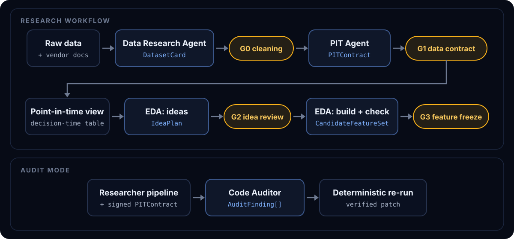
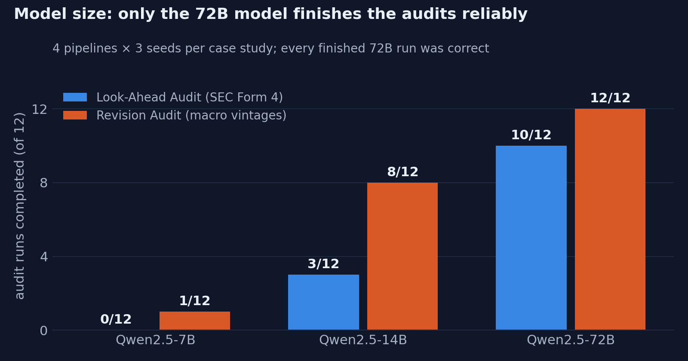
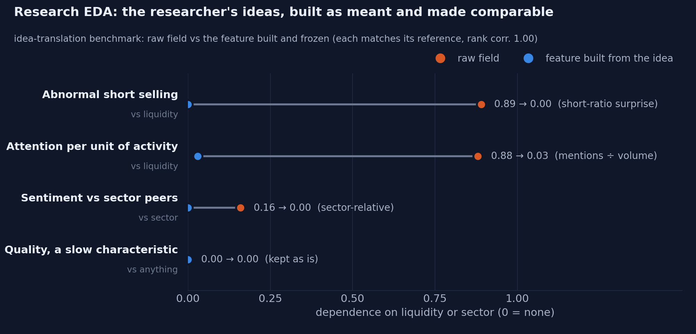

<p align="center"></p>

<p align="center">
  <a href="https://ziwang3.github.io/QuantAccelerator/"><b>▶ Interactive demo</b></a> ·
  <a href="#results">Results</a> ·
  <a href="#how-it-works">How it works</a> ·
  <a href="#quickstart">Quickstart</a>
</p>

<p align="center">
  
  
  
  
</p>

**QuantAccelerator** is a multi-agent helper for quantitative research. It takes on the heavy, data-intensive work
around a research idea: understanding an unfamiliar dataset, establishing **when each record was really knowable and
tradable**, auditing research code for look-ahead, building the first features, and testing them against returns under
pre-registration, held-out validation and an adversarial critic.

It does not trade, size positions or manage risk: those decisions stay with people. Every judgment cites a logged
computation, every handoff between agents is validated, and humans sign off at explicit gates (cleaning, timing rule,
feature ideas, feature freeze, test plan, locked-test release), so the agents' work is verifiable and traceable. The goal is to accelerate research and alpha
discovery in fast-moving markets without giving up control over what is true.

> **[Open the interactive demo →](https://ziwang3.github.io/QuantAccelerator/)** A replay of recorded runs: every
> agent step, tool call, finding and verified patch, plus the benchmark results. One self-contained page, no server.

---

## What it does

| Stage | Agent | Output | Human gate |
|---|---|---|---|
| **Understand** | Data Research Agent reads the docs and profiles the data: what the dataset is (publisher, market, which kinds of entities, which values), the first rows of every table, field meanings, coverage, missingness (null vs zero vs absent), distributions, structural breaks, what the data can support | `DatasetCard` + findings + cleaning proposal | **G0** approve cleaning |
| **Trust** | PIT Agent separates event, publication and first-tradable time; time zones, revisions, holidays | `PITContract` | **G1** sign the data contract |
| **Audit** | Code Auditor traces a researcher's pipeline, finds the look-ahead at the exact line, measures its impact, proposes a patch and proves it by re-running | `AuditFinding[]`, verified patch | — |
| **Research, phase A** | Research EDA Agent starts from ideas: it brainstorms feature ideas and translates the researcher's own from plain words (each with a mechanism, assumptions and an untested expected direction), then builds the approved ones and checks their distribution, variation and comparability across liquidity, size and sector, without seeing returns | `IdeaPlan`, `CandidateFeatureSet` | **G2** review ideas, **G3** freeze before returns |
| **Research, phase B** | Predictive Planner pre-registers each frozen feature's expected sign, horizons and controls; Predictive EDA Agent tests the plan through a returns vault that shows it the discovery years only; the orchestrator re-tests every finding on held-out years | `PredictionPlan`, `ResearchObservation[]` | **G4** sign the plan and the split |
| **Critique** | A standard robustness battery plus the Critic, which attacks every validated finding from its outputs only, with executable tests judged by a fixed rule; then cost and capacity of the finding's portfolio | `Critique[]`, costs | **G5** release to the locked test (opened once) |
| **Backward loop** | Questions research cannot answer (a break in a feature, a timing doubt) are routed back to the Data Research or PIT agent and answered with cited runs before the next gate | `InvestigationResult[]` | — |

<p align="center"></p>

Three case studies, each with its own exact answer key:

- **SEC Form 4 insider filings**: the EDGAR acceptance timestamp says exactly when each filing became public.
- **ALFRED macro vintages** (FRED): every published vintage says which revision was known on which date.
- **FINRA daily short-sale volume**: publication rules, plus planted data defects and vendor fields of known structure.

## Results

All numbers below come from logged runs against answer keys the agents never see (Qwen2.5-72B-Instruct-AWQ served
locally with vLLM, temperature 0).

**Look-ahead audits.** For each case study we wrote one correct researcher script (an insider-buying event table; a
macro feature table) and three copies of it, each with exactly one line changed to a mistake researchers really make
(e.g. keying an event on the trade date instead of when the filing became public, or using today's revised macro
values). Exact public timestamps (SEC EDGAR acceptance times; ALFRED's publication date of every value) give the answer
key: for every row, when it could first be used. The agents get the data, its documentation and one script, with no
hint whether it is leaky or where.

| Case study | Leaks found at the exact line | Patches verified by re-run | False alarms | Availability rule |
|---|---|---|---|---|
| SEC Form 4 (2025 Q1) | **3 / 3** | **3 / 3** | 0 | 100% |
| SEC Form 4, out-of-sample (2024 Q1, unchanged code) | **3 / 3** | **3 / 3** | 0 | 100% |
| ALFRED macro vintages | **3 / 3** | **3 / 3** | 0 | 100% |

<p align="center"></p>

**Data Research** (FINRA with five planted defects: duplicates, a ×100 unit change, zeros standing for missing, a
coverage hole, impossible rows): **5 / 5 found**, the cleaning recipe fixes them exactly, **0 clean rows dropped**, and
a deliberately thin sample (1 year × 40 symbols) is correctly judged too weak for cross-sectional research.

**Research EDA** (idea translation): on the FINRA panel with three vendor fields of known structure (mention counts
that scale with trading activity, a sentiment score with a sector bias, a clean persistent quality score), the
researcher gives four ideas in plain words. A translation passes when the frozen feature tracks a reference
construction (same-date rank correlation ≥ 0.9), is free of the planted bias, and leaves the clean score alone; the
agent must also explore at least two ideas of its own. In the final evaluation, **all four researcher ideas were built as meant, and
free of the planted biases, in 3 of 3 independent repeats** (21 of 21 idea checks); 2 of the 3 repeats also kept two
ideas of their own in the frozen set (8/8), while the third set both aside with measured evidence (7/8).

<p align="center"></p>

**Predictive EDA and the Critic** (planted returns): synthetic returns on the real FINRA panel (935 stocks, NYSE
calendar 2021–2025) with six planted relations, run through the whole loop (pre-registration, discovery, validation,
Critic, release, locked test) from scratch in each repeat:

| Planted | Must happen | Repeats passing (release code) |
|---|---|---|
| P1 short-lived negative effect of abnormal short selling | found, never refuted, passes the locked test | **3 / 3** |
| P2 slow positive effect of a quality score | found at long horizons, passes the locked test | **3 / 3** |
| P3 raw mention count that "predicts" only through an illiquidity premium | called *explained by liquidity*, never released | **3 / 3** |
| P4 sector-relative sentiment that reverses after the discovery years | stopped at validation | **3 / 3** |
| P5 same-day effect that exists only in the least liquid third | refuted by the standard battery, not released | **3 / 3** |
| P6 positive effect that exists only in Technology (survives the battery) | refuted by the **Critic agent** itself, not released | **1 / 3** |
| Nulls (attention per unit of activity, volume shock) | never validated | **3 / 3** |

Plus the process checks (pre-registered signs right, locked test opened exactly once): 41 of 45 checks over three
repeats. The weak point is the Critic agent: it sees each finding's IC by sector, and when it misses P6 it either names
the sector threat but tests it with a sector *control* (which cannot remove a within-sector effect) or does not raise
it at all (5 of 9 runs with the final design caught P6).

**A real study: FINRA short volume against CRSP returns.** The five features frozen in the final Research EDA run on
the real panel were tested against CRSP daily returns (aggregate statistics only). The researcher signed the plan at G4
with one change (reversal and momentum added as controls for the short-selling features); 79 distinct tests were run,
so a discovery needed |t| ≥ 3.0.

| Finding (rank IC, t) | Discovery 2022–23 | Validation 2024 | Locked test 2025 |
|---|---|---|---|
| Short-exempt share of volume, same day | −0.019 (−6.7) | −0.023 (−4.4) | **−0.013 (−2.9): passed** |
| Short-exempt share of volume, 5 sessions | −0.030 (−5.8) | −0.025 (−3.0) | −0.015 (−1.9): failed |
| Short-exempt share of volume, 20 sessions | −0.043 (−4.0) | −0.033 (−2.5) | −0.011 (−0.8): failed |
| Abnormal short selling (the researcher's idea), same day | −0.008 (−3.6) | −0.003 (−0.9): failed | — |
| Volume per unit of activity, 20 sessions, net of size | +0.020 (+4.1) | +0.009 (+1.1): failed | — |

The surviving same-day effect is real but small: without the least liquid third of names only half of it remains,
and the gross edge of its long-short portfolio is used up at a half-spread of about 2–4 bp per side per trade, so it is
very likely not tradable. The value of the loop here is that negative answer, reached with every test on record.

## How it works

- **Deterministic tools, logged numbers.** The LLM never computes a number. Every statistic comes from a tool call
  recorded with a run id, its inputs' hashes and the code version; findings must cite those run ids, and dates in a
  claim are checked against the cited tool output.
- **Typed shared state.** Agents emit pydantic models (`DatasetCard`, `PITContract`, `AuditFinding`,
  `CandidateFeatureSet`) that are validated before anything moves on; invalid output is returned to the agent with an
  error that names the fix.
- **Humans decide what carries risk.** Cleaning (G0), the availability rule (G1), the feature ideas (G2), the feature
  set (G3), the test plan (G4) and the locked-test release (G5) are signed off by a person, in a Jupyter workbench (`notebooks/workbench_finra.ipynb`, `notebooks/research_finra.ipynb`).
- **A point-in-time research view.** Once G1 is signed, one deterministic view puts every record at its decision time;
  research code cannot rebuild the timing joins itself, and the view refuses to exist without a signed contract.
- **Return-blind feature construction.** Features are built in a closed language (ratio, change, surprise,
  sector-relative, residualize, rank), never free code, and characterized by same-date rank dependence on liquidity,
  size and sector. Rules from research practice are enforced: a dependence is a question, not a verdict (list the
  explanations first); never neutralize what is not there; keep a dependence only after comparing a version without it.
- **Verified patches.** An audit fix is accepted only if re-running the patched pipeline brings measured look-ahead to
  zero.
- **A returns vault.** Returns exist only behind a vault that opens for a frozen (G3, hashed) feature set and a signed
  plan (G4). The agent sees the discovery years; validation is re-run by the orchestrator; the locked test opens once
  per feature set, ever. Forward returns start at the first open the signed timing rule allows, and every access,
  granted or refused, is logged.
- **Counted tests, pre-registered claims.** Every distinct test (horizon, control set, bucket, attack) is counted per
  feature set, across sessions, and a discovery must clear |t| ≥ max(3, √(2 ln N)). A finding must survive the
  controls the signed plan named; a null that hides a significant raw relation is called "explained by" its control;
  every planned horizon is owed an observation.
- **An adversary with no data access.** The Critic sees findings' outputs, never the author's reasoning, and writes
  attacks in a closed language; each must be able to falsify the threat it names. The verdict comes from a fixed rule,
  not from the Critic, and a refutation is re-run on the finding's siblings.
- **Built for a 32k-token context.** Long agent loops run in passes with fresh context, with older tool results
  compacted to one-line readings; everything stays inspectable in the run directory (transcripts, tool outputs,
  figures).

## Quickstart

```bash
pip install -e ".[dev]"
pytest -q                                     # offline; tests that need the downloaded data are skipped

# Data: public sources (SEC EDGAR Forms 3/4/5 and submissions, FRED/ALFRED, FINRA daily short-sale
# volume, SEC company facts), placed under Dataset/data/raw/; then ingest
python -m quantaccelerator.ingest.insider && python -m quantaccelerator.ingest.submissions
python -m quantaccelerator.ingest.finra && python -m quantaccelerator.ingest.sec_reference

# Any OpenAI-compatible endpoint; developed with vLLM serving Qwen2.5-72B-Instruct-AWQ, e.g.
#   vllm serve Qwen/Qwen2.5-72B-Instruct-AWQ --max-model-len 32768 --enable-auto-tool-choice --tool-call-parser hermes
export LLM_BASE_URL=http://127.0.0.1:8000/v1 LLM_MODEL=Qwen/Qwen2.5-72B-Instruct-AWQ

python -m quantaccelerator.demo --all --oracle --batch my-batch           # Look-Ahead Audit, 4 pipelines
QA_DATASET=finra python -m quantaccelerator.demo --understand              # Data Research Agent + Data Brief
QA_DATASET=finra python -m quantaccelerator.demo --explore --idea "your idea in plain words"   # Research EDA
QA_DATASET=finra_pred python -m quantaccelerator.demo --predict --oracle    # phase B on the planted-returns benchmark
python -m quantaccelerator.eval.gold_pred runs/predict-<batch>-finra_pred    # score it

# Phase B on real data needs CRSP daily stock data (licensed, from WRDS; CIZ or legacy CSV) under
# Dataset/data/raw/crsp/; then
python -m quantaccelerator.ingest.crsp && python -m quantaccelerator.ingest.crsp check   # ingest, check vs Tiingo
QA_DATASET=finra python -m quantaccelerator.demo --predict --from runs/<an explore run>  # G4 and G5 at the prompt
```


## Repository layout

```
src/quantaccelerator/
  agents/      agent loop, Data Research, PIT, Code Auditor, Research EDA, Predictive EDA, Critic, the backward loop,
               orchestrator, briefs and reports
  returns/     forward returns, point-in-time controls and statistics; the returns vault; costs
  tools/       deterministic tools (profiling, timing, look-ahead measurement, cleaning, PIT view, features,
               predictive tests, critic attacks)
  datasets/    one profile per case study: tables, docs, tasks, answer key, availability measure
  eval/        answer keys and scorers (audits, planted defects, idea translation, planted returns)
  ingest/      raw public data -> parquet, with provenance manifests
  viz/         the interactive page (docs/index.html)
  notebook.py  the Jupyter workbench API
notebooks/     researcher pipelines under audit (clean + leaky variants) and two walkthrough notebooks
tests/         offline tests (scripted LLM client for agent loops)
docs/          the interactive demo page and README figures
```

## Limitations

- One open-weights model (Qwen2.5-72B, AWQ), temperature 0; smaller models are far less reliable (see the chart).
- Development benchmarks: the checks were improved while studying these runs (none reads an answer key), and the
  planted structures are simple.
- Phase B on real data runs on CRSP (licensed; not included). The real study's critique and cost check ran after its
  locked test (they were built afterwards); its net returns and capacity need quoted spreads (CRSP bid/ask), since
  Roll's estimate from daily returns is too noisy for liquid stocks.
- The Critic agent is measured on one planted case it alone can reach; it can name the right threat and still choose
  a test that cannot falsify it.
- Conditioning data for research EDA are offline proxies: off-exchange share volume for liquidity, SEC public float
  for size, current SIC for sector.

